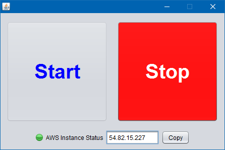
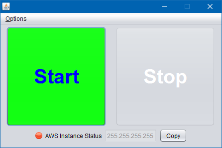

# EC2PushButton

Simple one button touch to start and stop a given EC2 instance.

### Motivation

This project started with a need to easily start and stop our [7 Days to Die game server](http://store.steampowered.com/app/251570/7_Days_to_Die/). Surprisingly, not everyone wanted to learn how to operate Amazon EC2 instances nor did they want to learn the nuances of Amazon Web Services (AWS) identity and access management (IAM). Consequently this project was born. Given an already created EC2 instance and existing credentials, team members may now start and stop the game server. Stopping is fairly important since we are all not yet strong players and if the server runs unchecked, the zombies would continue to get stronger and more aggressive.

## Getting Started

To build this project you will need the following:

* JDK
* Maven
* AWS Account (free tier is ok)

## Running

### Prerequisites

A Java runtime environment (JRE) is required. So first navigate to the Java download page and get the latest version for your PC. Note: you must first accept the license agreement. In most cases, choose the 64-bit version.

[Java SE Runtime Environment 8 Downloads](http://www.oracle.com/technetwork/java/javase/downloads/jre8-downloads-2133155.html).

### Installing

### Windows

Download the Windows executable and place it in a local folder, e.g. C:\Users\tools. Double click on the file name, `EC2PushButton-0.0.1-SNAPSHOT.exe` to run the app.

The first time the application is run, it will prompt for credentials. Currently, an AWS key and secret are the only form of identity that is supported. Enter the key and secret and click on OK.

The Amazon AWS credential store will detect that a new key and secret has been added and ask you to confirm. Click on yes.

The app is now ready to start the EC2 instance.

### Mac and Linux

Support for Mac and Linux is on the way...

## Acknowledgements

[README template](https://gist.github.com/PurpleBooth/109311bb0361f32d87a2) from [@PurpleBooth](https://gist.github.com/PurpleBooth).
